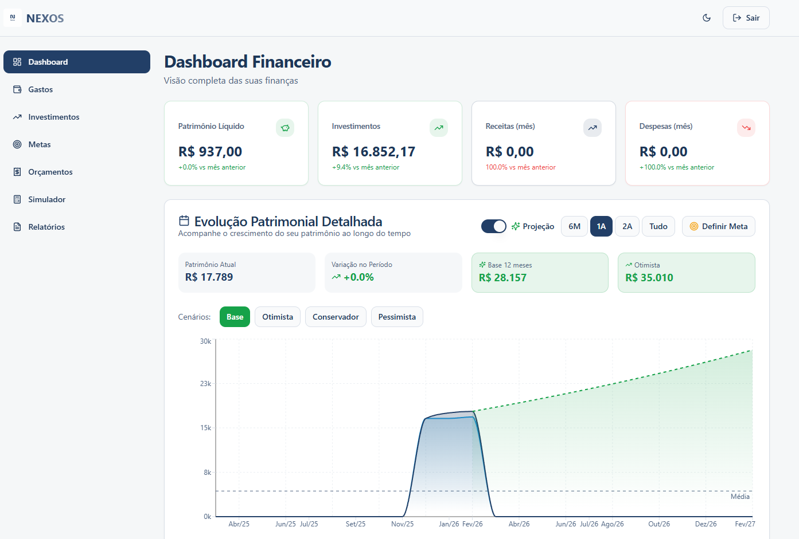
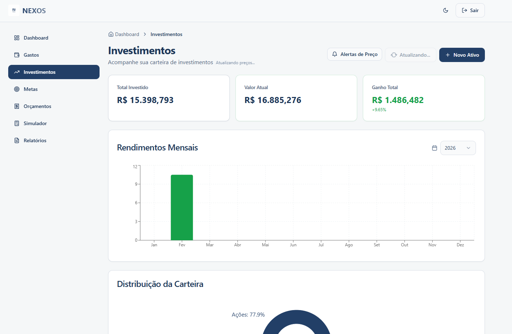

Desenvolvi o Nexos, uma plataforma de gestão financeira inteligente criada para centralizar o controle de património, investimentos e fluxo de caixa. O projeto foi construído utilizando o Lovable, uma plataforma de desenvolvimento baseada em IA que permitiu transformar conceitos complexos em uma interface robusta e funcional de forma ágil. Muito além de uma simples folha de cálculo, o Nexos conecta rendimentos a metas reais, oferecendo uma visão clara para organização e projeções de longo prazo. O objetivo é transformar dados em decisões, ajudando os utilizadores a dominarem as suas carteiras e acelerarem a sua independência financeira.
# 💰 Nexos - Gestão Financeira Inteligente




O **Nexos** é uma solução completa para controle de finanças pessoais, desenvolvida para ajudar usuários a organizarem suas receitas e despesas com uma interface intuitiva e um backend robusto e conectado.

## 🛠️ Funcionalidades Principais
- ✅ **Autenticação Segura:** Proteção de dados e acesso individualizado.
- ✅ **Fluxo de Caixa:** Registro detalhado de todas as entradas e saídas.
- ✅ **Dashboard Dinâmico:** Visualização clara do resumo mensal e saldo atual.
- ✅ **Categorização:** Organização inteligente de transações para melhor análise de gastos.

## 📦 Como rodar o projeto

```bash
# 1. Clone o repositório
git clone [https://github.com/MChaves-21/xnexos](https://github.com/MChaves-21/xnexos)

# 2. Suba o banco de dados via Docker
docker-compose up -d

# 3. Instale as dependências
npm install

# 4. Rode as migrações do Prisma para estruturar o banco
npx prisma migrate dev

# 5. Inicie o servidor de desenvolvimento
npm run dev

## 🏦 Open Finance e importação de extratos

O Nexos importa transações e investimentos de duas formas, que caem na mesma tela (**Open Finance**) e passam pela mesma deduplicação e categorização.

### 1. Arquivo CSV/OFX (gratuito, sem terceiros)
No app do Nubank, exporte a **fatura do cartão (CSV)** ou o **extrato da conta (CSV ou OFX)** e use **Importar arquivo**.
- O arquivo é lido no navegador; nada é enviado além das transações já normalizadas para o seu banco Supabase.
- Reimportar o mesmo arquivo não duplica: usa o `Identificador`/`FITID` quando existe, senão um hash de conta + data + valor + descrição.
- Parcelas ("Parcela 2/5"), estornos, UTF-8/Windows-1252 e vírgula ou ponto decimal são tratados.
- Não versione extratos reais (`*.ofx` e CSVs na raiz estão no `.gitignore`).

### 2. Conexão automática via Pluggy (Open Finance)
1. Crie uma conta em [dashboard.pluggy.ai](https://dashboard.pluggy.ai) e pegue `CLIENT_ID` e `CLIENT_SECRET`.
2. Cadastre como secrets das Edge Functions (nunca no `.env` do front):
   `PLUGGY_CLIENT_ID`, `PLUGGY_CLIENT_SECRET` e `PLUGGY_CRON_SECRET` (um valor aleatório longo).
3. Para uso pessoal gratuito, conecte seu banco no **Meu Pluggy** (meu.pluggy.ai) e cole o *Item ID* em **Conectar Banco → Meu Pluggy**. O botão **Abrir Pluggy Connect** abre o widget oficial (inclui os conectores de sandbox; desligue com `VITE_PLUGGY_INCLUDE_SANDBOX=false`). Confira os limites atuais do plano gratuito na documentação da Pluggy.
4. Sincronização automática diária (06:00): a migração `20260930193700_…sql` agenda o job com `pg_cron`. Guarde o mesmo valor de `PLUGGY_CRON_SECRET` no Vault uma vez:
   ```sql
   select vault.create_secret('<valor de PLUGGY_CRON_SECRET>', 'pluggy_cron_secret');
   ```

A sincronização busca o status do item (consentimento expirado vira **Reconectar**), as contas, as transações de cada conta (com paginação, ignorando as pendentes) e os investimentos.

### Categorização
Ordem: regras aprendidas com as suas correções → regras padrão por palavra-chave → IA (só para o que sobrar). Ao trocar a categoria de uma transação, o Nexos grava a regra e aplica às pendentes parecidas.

### Testes
```bash
npm test
```

## 🧭 Modo simples e modo completo
- **Simples (padrão para novas contas):** menu com Início, Transações, Metas e Conectar banco; resumo do mês em frases, alertas e maiores gastos.
- **Completo:** acrescenta Contas a pagar, Cartões, Investimentos (com comparação ao CDI e à inflação), Imposto de Renda, Família, Simulador (preenchido com seus dados), Relatórios, Categorização, Regras e os gráficos do Início.
- A escolha fica no perfil (`profiles.ui_mode`) e vale em qualquer dispositivo. O primeiro acesso guiado aparece uma vez (`profiles.onboarding_completed`).
- Taxas Selic, CDI e IPCA vêm da Edge Function `market-rates` (API pública do Banco Central, com valores de reserva se estiver fora do ar).

## 🧪 Testes
```bash
npm test          # unitários + regras de segurança do banco (migrações reais num Postgres embutido, PGlite)
npm run test:e2e  # ponta a ponta no navegador (Playwright), com o Supabase simulado e auditoria de acessibilidade
```
- `supabase/tests/rls.test.ts` tenta, como usuário comum, criar conexões com o item de outra pessoa, gravar em conexões alheias e ler dados de terceiros. Tudo deve ser bloqueado.
- `e2e/` cobre investimentos do banco na carteira, cenários de erro (banco desatualizado, falha de rede, sem internet, tela que não carrega), primeiro acesso, exportação CSV segura, contas a pagar, cartões, IR, família/convites, avisos, exclusão de conta e acessibilidade (WCAG A/AA) no computador e no celular.

## 🔒 Segurança
- Conexões com a Pluggy só são criadas pela Edge Function `pluggy-connect`, que confere o dono do item; um item só pode estar em uma conta.
- Dados sincronizados só podem ser gravados em conexões do próprio usuário (RLS).
- Edge Functions validam a entrada e não devolvem detalhes internos de erro.
- A exportação CSV neutraliza fórmulas (proteção contra "CSV injection").

## 👨‍👩‍👧 Uso em família (cada pessoa com a própria conta Pluggy)
O plano gratuito da Pluggy aceita um só CPF por conta (e até 5 conexões). Para a família, cada pessoa usa a própria conta gratuita da Pluggy; quem não tiver usa a conta Pluggy do app.

Para cada familiar (feito uma vez, por quem administra):
1. Crie a conta dele no Nexos e entre com ela.
2. Crie uma conta gratuita em dashboard.pluggy.ai com o e-mail e o CPF dele e copie o **Client ID** e o **Client Secret**.
3. No Meu Pluggy dessa conta, conecte o banco dele. **Ele aprova no app do banco, no celular dele.** Copie o **Item ID**.
4. No Nexos, em **Conectar banco → Avançado: usar uma conta Pluggy própria**, cole o Client ID e o Client Secret e salve. A Pluggy confere as credenciais antes de salvar.
5. Em **Conectar Banco**, cole o Item ID. Pronto: a sincronização diária usa a conta Pluggy dele.

As credenciais ficam cifradas (AES-GCM) na tabela `pluggy_credentials`, que o app não consegue ler; só as Edge Functions acessam. A chave de cifragem vem do segredo `PLUGGY_CREDENTIALS_KEY` (opcional) ou, sem ele, da service role key do projeto. Se essa chave mudar, basta cadastrar as credenciais de novo.

Também dá para convidar a família por link: em **Família**, crie a família e clique em **Gerar link de convite** (um link por pessoa, de uso único, válido por 7 dias). A pessoa abre o link, cria a própria conta e entra na família. O painel do administrador mostra só o **estado** das conexões de cada um (banco conectado, precisa reconectar, consentimento perto de vencer), nunca valores ou transações.

## 📅 Contas a pagar, cartões e Imposto de Renda
- **Contas a pagar** (`/bills`): contas mensais ou de uma vez, com calendário do mês (inclui o vencimento das faturas) e botão "Marcar como paga".
- **Cartões** (`/cards`): fatura atual, fechamento, vencimento, pagamento mínimo, uso do limite e parcelas futuras (dados da Pluggy).
- **Imposto de Renda** (`/taxes`): resumo do ano com despesas de saúde e educação, rendimentos por categoria e bens e direitos pelo custo de aquisição. Exporta CSV. É um apoio: confira sempre com os informes oficiais.

## 🔔 Avisos
A função agendada `pluggy-sync-all` sincroniza os bancos e depois gera avisos no app (sino no topo): consentimento perto de vencer, banco que precisa reconectar, erro de sincronização, orçamento em 80%/100%, contas e faturas vencendo e um resumo semanal às segundas.
E-mail é opcional: defina os segredos `RESEND_API_KEY`, `APP_URL` (ex.: `https://seu-app.lovable.app`) e, se quiser, `NOTIFICATIONS_FROM_EMAIL`. Cada pessoa ativa ou desativa o e-mail em **Conta e privacidade**.

## 📱 Instalar no celular (PWA)
O Nexos pode ser instalado como app: no Android/Chrome aparece o botão **Instalar**; no iPhone, use Compartilhar → **Adicionar à Tela de Início**. O service worker (`public/sw.js`) só guarda os arquivos do próprio app, nunca dados financeiros, e não é registrado dentro do preview do Lovable.

## 🛡️ Privacidade (LGPD)
- Página pública `/privacy` com a política em linguagem simples.
- Em **Conta e privacidade**: baixar todos os dados (JSON) e excluir a conta. A exclusão (Edge Function `delete-account`) remove as conexões na Pluggy, todos os dados e o login. É preciso digitar **EXCLUIR** para confirmar.

## ⚙️ CI e publicação
- `.github/workflows/ci.yml`: em todo PR e push roda typecheck, testes, build, checagem das Edge Functions e testes no navegador.
- O banco fica no Lovable Cloud, então migrações e Edge Functions são aplicadas pelo Lovable (peça no chat: "aplique as migrações pendentes e faça o deploy das Edge Functions, sem alterar o código"). Depois, publique o site em **Publish → Update**.
- As migrações são idempotentes: podem rodar de novo sem quebrar.
